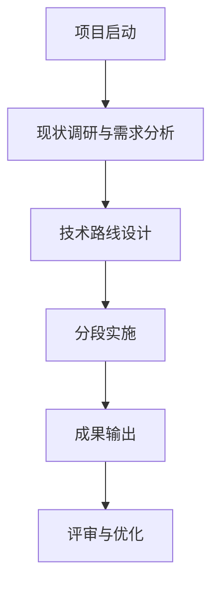

# Step 2：分段撰写投标文件正文

## 任务说明

基于 `new-prompt.md` 适配后的 Prompt，执行投标文件正文的分段撰写工作流。

---

## 输入材料

- `new-prompt.md`：经 Step 1 适配后的完整投标写作 Prompt
- 用户确认的大纲
- 背景材料与工作范围

---

## 撰写流程

### Step 2.1：接收大纲确认

接收用户确认的大纲或具体撰写指令（如："请按大纲撰写 1.1 节"）。

### Step 2.2：执行分段撰写

按以下模块分组，同时或依次启动子程序撰写各部分内容：

| 序号 | 模块 | 说明 |
|------|------|------|
| 1 | 项目背景 | 根据主题，联网搜索最新政策、案例和数据后撰写 |
| 2 | 工作目标 | 基于 new-prompt.md 中的目标要求撰写 |
| 3 | 工作内容 | 针对"工作目标"，对应展开工作范围和具体任务 |
| 4 | 工作方法 | 论述技术方法和技术路线，针对"工作内容"提出 |
| 5 | 项目成果 | 描述项目预期成果的名称、数量和要求 |
| 6 | 项目重点、难点分析 | 分析并提出项目的重点和难点问题 |
| 7 | 项目重点、难点的应对措施 | 针对每个重点/难点逐一提出应对措施（数量对应） |
| 8 | 相关的合理化建议 | 提出与项目重难点相关的合理化建议 |

#### 关键约束

1. **项目背景**
   - 必须联网检索最新政策文件、行业导向和典型实践
   - 检索方向：海洋经济、滨海旅游、公共资源利用、文旅消费场景创新等
   - 结合项目主题，融入地方特色

2. **工作内容**
   - 必须针对"工作目标"展开
   - 逻辑线：目标 → 任务 → 内容

3. **工作方法**
   - 论述技术方法和技术理论
   - 必须针对"工作内容"提出
   - 说明具体采用何种方法、工具、流程

4. **项目重点、难点分析**
   - 对照评分准则撰写
   - 提出清晰的重点和难点问题

5. **项目重点、难点的应对措施**
   - **数量必须与重点/难点一一对应**
   - 例如：提出 4 个重点 + 4 个难点 = 需对应 8 个应对措施
   - 每条措施需与对应的问题形成明确对应关系

6. **相关的合理化建议**
   - 建议需与重难点分析形成呼应
   - 科学可行，具有针对性

7. **防幻觉占位**
   - 遇地方特定数据、现状底数、企业资源等缺失时
   - 统一使用 `[需补充：XXX]` 占位

8. **配图提醒**
   - 在技术路线图、研究框架图、案例对比表等位置
   - 插入：`[🖼️此处建议插入图表：图表名称，内容说明]`

---

### Step 2.3：生成技术路线

完成所有模块撰写后，读取已生成的内容，然后生成"技术路线"部分：

**技术路线内容包含：**

1. **简要冒段文字**
   - 概述整体技术路线和方法论框架
   - 逻辑清晰，语言专业

2. **技术路线图（mermaid 代码）**
   - 使用 mermaid 格式绘制技术路线图
   - 包含主要阶段、节点、输出物

**mermaid 示例结构：**

---

## 输出文件

| 序号 | 文件 | 内容 |
|------|------|------|
| 1 | `section-项目背景.md` | 项目背景文字 |
| 2 | `section-工作目标.md` | 工作目标文字 |
| 3 | `section-工作内容.md` | 工作内容文字 |
| 4 | `section-工作方法.md` | 工作方法文字 |
| 5 | `section-项目成果.md` | 项目成果文字 |
| 6 | `section-项目重点难点分析.md` | 重点难点分析文字 |
| 7 | `section-项目重点难点应对措施.md` | 应对措施文字 |
| 8 | `section-相关的合理化建议.md` | 合理化建议文字 |
| 9 | `section-技术路线.md` | 技术路线冒段 + mermaid 代码 |

---

## 核心原则

1. **分段撰写**：每个模块独立撰写，完成后暂停等待确认
2. **数量对应**：重点/难点与应对措施必须一一对应
3. **目标导向**：工作内容必须针对工作目标
4. **方法针对**：工作方法必须针对工作内容
5. **联网搜索**：项目背景必须联网检索最新政策与案例
6. **防幻觉**：缺失信息使用占位符，不凭空捏造
